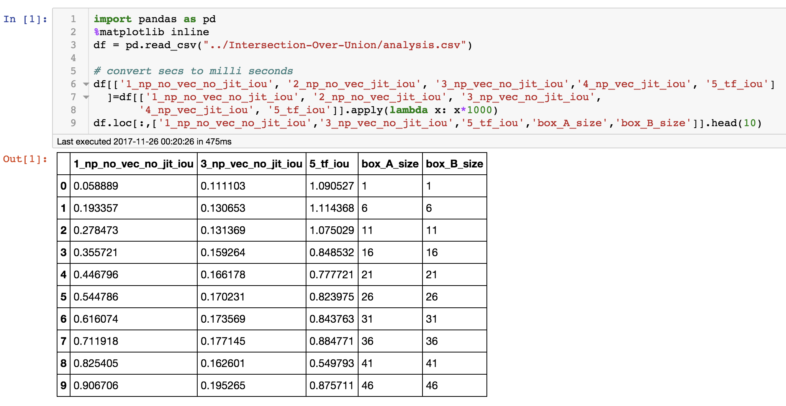
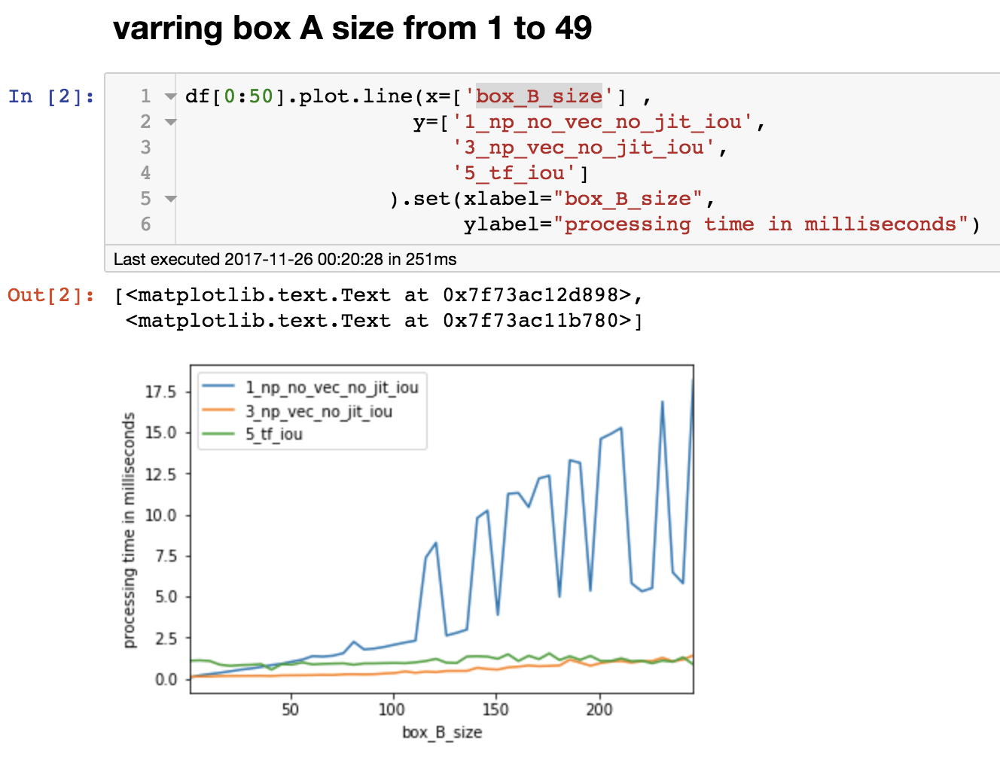
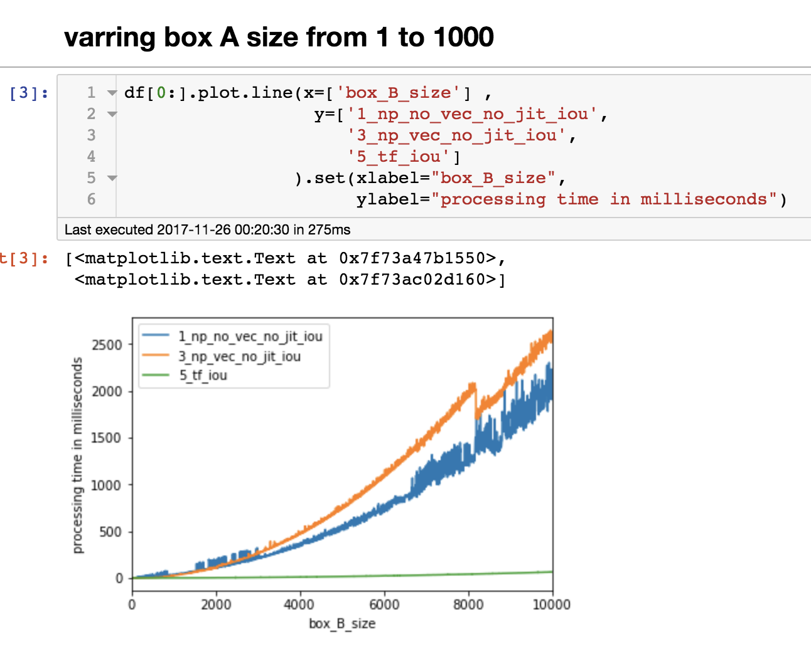

**Vectorizing Intersection Over Union (IOU)**
-

In this repo I vectorize IOU on multiple platforms and benchmark each in terms of runtime:

- Numpy

- Numba

- Tensor Flow 

Reading the csv into pandas

When box A's size is than 5 the non vectorized version performs better and when box A's size is greater than 5 numpy's 
vectorized version runs better

Tensor flow's runtime is pretty much constant all thru, and performs better when the number of boxes are greater than 100, 
When the number of boxes are less than 100 the over head of copying the data to the GPU is greater than the processing time.
      
Another interesting observation here is that the for loop version of IOU performs better that the vectorized version when the number of boxes is greater than 

